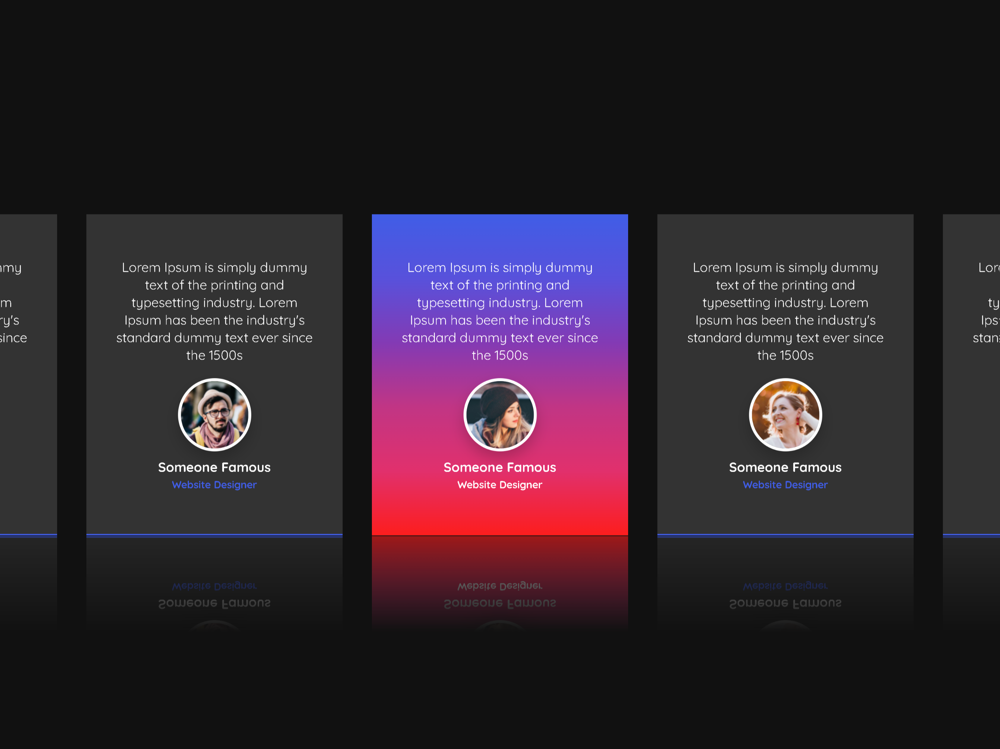

<h1 align = "center">
 
  
   
     
  Text Slider – HTML, CSS, JavaScript
   
</h1>

<h3 align = "center"> Interactive Front End Development </h3>

## Text Slider

Swiper.js

## Project Specifications

- Cards can get swiped left or right when a user interacts by swiping.